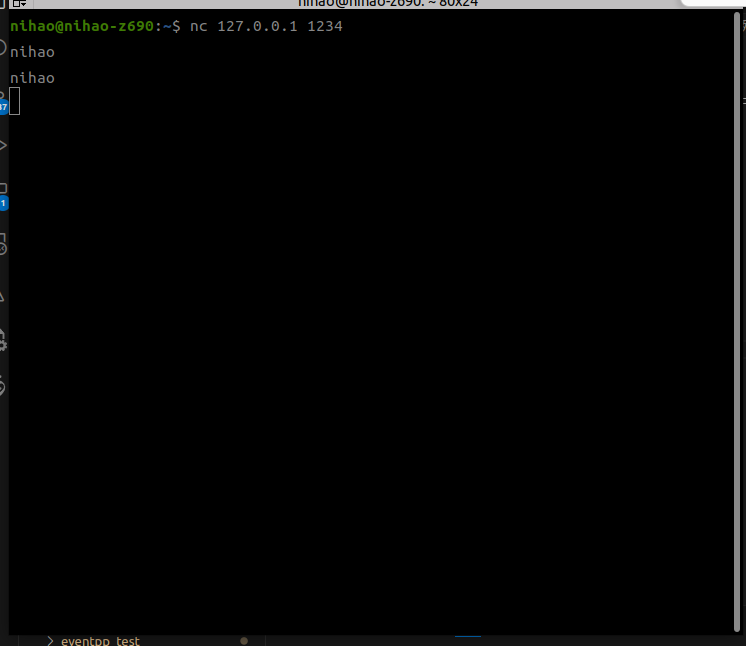

# create a new project

The 'examples/demo1' folder is a 'Hello, World!' project that can be used as a template for quickly creating your own project by duplicating this folder.

## File tree
``` bash
demo1
├── build_after.sh
├── CMakeLists.txt
├── config_defaults.mk
├── main
│   ├── CMakeLists.txt
│   ├── include
│   │   └── main.h
│   ├── Kconfig
│   └── src
│       └── main.c
├── Makefile
└── project.py

4 directories, 10 files
```


- **main** Main code directory
- **main/CMakeLists.txt** CMake files for the main code, requiring manual addition of dependency folders.
- **config_defaults.mk** Default configuration files, storing default component configurations.
- **build_after.sh** Bash script file that is automatically executed after compilation is completed. It runs when present and is ignored if absent.
- project.py Project's startup entry point, no need for modifications.
- CMakeLists.txt Main CMake file, project definitions start from here, no modifications needed.
- Makefile Convenient operation Makefile script that allows adding custom commands and redefining existing ones.


## Creating a project example
Taking the 'mongoose_tcp_echo' TCP echo server example from 'examples/mongoose_tcp_echo' as an example, create a new project by copying the 'examples/demo1' folder.

Mongoose is a lightweight TCP library that can be easily used in devices like ESP32, STM32, RP2040, and Linux, enabling convenient development of TCP projects.

```bash
# Enter the 'examples' folder.
cd examples

# Copy the 'demo1' folder to 'mongoose_tcp_echo'.
cp demo1 mongoose_tcp_echo -r

# Enter the 'mongoose_tcp_echo' directory.
cd mongoose_tcp_echo

# Edit 'main/src/main.c' and input the following content.


############################### mongoose_tcp_echo/main/src/main.c ###############################
#include "mongoose.h"

struct mg_mgr mgr;

void printf_connect(struct mg_connection *c)
{
  if (!c->rem.is_ip6)
  {
    printf("ip:");
    printf("%d", c->rem.ip[0]);
    printf(".");
    printf("%d", c->rem.ip[1]);
    printf(".");
    printf("%d", c->rem.ip[2]);
    printf(".");
    printf("%d", c->rem.ip[3]);
    printf("  port:%d \n", c->rem.port);
  }
}
static void cb(struct mg_connection *c, int ev, void *ev_data, void *fn_data)
{
  switch (ev)
  {
  case MG_EV_OPEN:
    break;
  case MG_EV_ACCEPT:
  {
    printf("SERVER accepted a connection  ");
    printf_connect(c);
  }
  break;
  case MG_EV_READ:
  {
    mg_send(c, c->recv.buf, c->recv.len); // Echo received data back
    printf_connect(c);
    printf("say:%s\n", c->recv.buf);
    mg_iobuf_del(&c->recv, 0, c->recv.len); // And discard it
  }
  break;
  case MG_EV_CLOSE:
    break;
  case MG_EV_ERROR:
    break;
  default:
    break;
  }
}
int main(int argc, char *argv[])
{
  mg_mgr_init(&mgr);                               // Init manager
  mg_listen(&mgr, "tcp://0.0.0.0:1234", cb, &mgr); // Setup listener
  for (;;)
  {
    mg_mgr_poll(&mgr, 1000); // Event loop
  }
  mg_mgr_free(&mgr); // Cleanup
  return 0;
}
#################################################################################################

```

Execute in the 'mongoose_tcp_echo' directory.
```bash
make menuconfig
```
Select 'Components configuration' to enter.


Then select 'Enable mongoose


Press 'q' to exit.


Press 'y' to save.

Then execute the compilation.
``` bash
make
```

After successful compilation, the 'mongoose_tcp_echo' executable file will be generated in the 'examples/mongoose_tcp_echo/dist' folder.

Run the 'mongoose_tcp_echo' program.
```bash
./dist/mongoose_tcp_echo
```
Use 'nc' to test the program's execution.

```bash
# Connect to the TCP server.
nc 127.0.0.1 1234

# Input any message and observe the returned information.
```





## Explanation of parameters in the Makefile.
```makefile
CROSS_DIR := /usr/bin           # Cross-compiler directory, set for use during cross-compilation.
CROSS := arm-linux-gnueabihf-   # Cross-compiler prefix, set for use during cross-compilation.
PUSH_FILE:=dist                 # Output directory for compiled files.
PUSH_DIR:=/root                 # Directory for pushing to the embedded device.
HOST_IP:=192.168.12.1          # IP address of the embedded device.
MSSHF:=-o StrictHostKeychecking=no  # SSH prefix configuration.
SSH_USER:=m5stack               # Username of the embedded device.
SSH_PASSWORLD:=123456           # Password of the embedded device.

# Template for the push command used. Please refer to its usage.
# scp ${MSSHF} -r ${PUSH_FILE} ${SSH_USER}@${HOST_IP}:${PUSH_DIR}
```

## Cross-compilation
``` bash
# Complete clean
make distclean

# Set the cross-compiler according to the Makefile preset
make set_arm

# Enable components
make menuconfig

# Compile
make

# Push files according to the Makefile preset
make push

# Simply enter the development environment and execute

```
## Cross-optimized compilation
```bash
# Complete cleanup
make distclean

# Set the cross-compiler according to the Makefile preset
make set_arm

# Enable components
make menuconfig

# Compile
make release

# Push files according to the Makefile preset
make push

# Simply enter the development environment and execute

```
## More commands
```bash
# Access the embedded device shell according to the Makefile preset
make shell

# Run directly on the local machine
make run

# Push and execute according to the Makefile preset
make push_run

```


